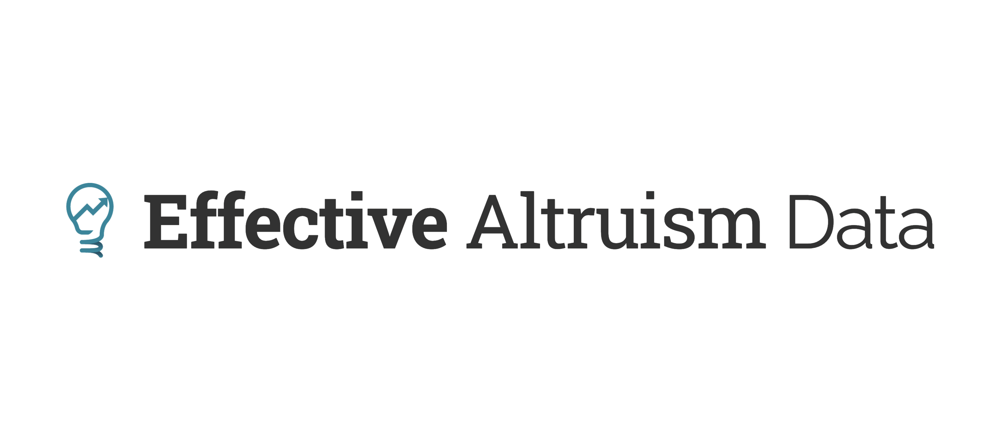

# [Effective Altruism Data](https://effectivealtruismdata.com)



[Effective Altruism](https://www.effectivealtruism.org/) (EA) is a philosophy and social movement that uses reason and evidence to do the most good.

There are several EA organisations that collect data on grants, donors, and pledges. This website aggregates and visualises that data.

The website is coded in Python using [Dash](https://dash.plotly.com/) and [Plotly](https://plotly.com/). It is currently deployed with Heroku at [effectivealtruismdata.com](https://effectivealtruismdata.com).

There may be some overlap between this project and with the [EA Hub map](https://eahub.org/) and the [EA Funds dashboard](https://app.effectivealtruism.org/funds/about/stats).

## How to run

1. Install [pipenv](https://pipenv.pypa.io/en/latest/). If you have `pip` installed, this looks like:

```
pip install --user pipenv
```

2. Run the following in the terminal:

```
git clone https://github.com/hamishhuggard/ea_data_viz.git
cd ea_data_viz
pipenv run python app.py
```

## To do

### Version 1 (Current Version)

- Download links
- Data refreshing
- Analytics
- OP Wilkinson Plots
  - Grants by size and by time
  - Organizations by #grants and by total amount
- EA Funds
  - Scatter
  - Cumulative grants
  - Grants by month/year
- Founders pledge
  - Members over time
  - Pledged value over time
  - Fulfilled commitments over time
- Title page with summary statistics
  - X EAs have donated Y amount and pledged a further Z.
- Probabilities of x-risks given by Toby Ord
- Global Poverty
  - Cost to save a life with most effective charities
- Value of Future
  - People currently alive
  - People who have ever lived
  - Projected peak population
  - Potential future earth people
  - Potential future space people
  - Potential future virtual people
- Animals
  - Most effective animal interventions
  - Number of animals in factory farms
  - Most effective diet interventions
- [Key EA numbers](https://github.com/benthamite/EA-numbers/blob/main/source.org)
- Spin off data aggregation to own Python library
- [Better bar charts](https://dkane.net/2020/better-horizontal-bar-charts-with-plotly/?utm_source=pocket_mylist)
- Space efficient data source annotations

### Version 2

- Reimplement in chart.js or D3.js
- See data as table or as plot
- Data download buttons
